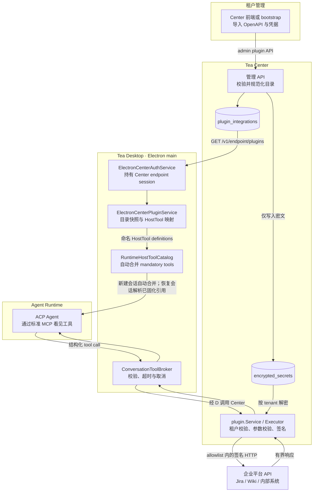
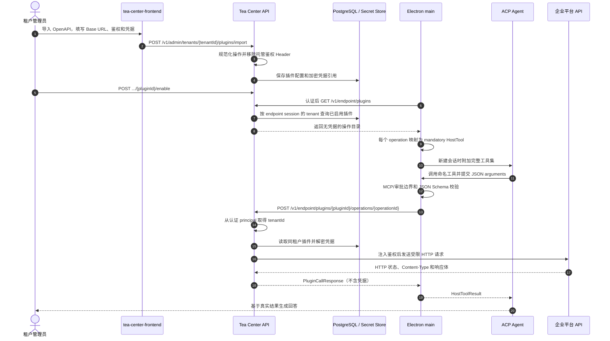

# Center 托管的企业插件

> 状态：已实现（第一期）
> 日期：2026-09-01
> 读者：Tea Desktop、Tea Center 和企业集成开发者

## 解决什么问题

企业希望 Tea Agent 能操作 Jira、Wiki、GitLab 或内部自研平台，但不希望
部署一套额外的 Connector Runtime。第一期采用“声明式 HTTP 插件”：租户
管理员向 Center 导入 OpenAPI、配置 Base URL 和鉴权；Desktop 自动把所有
已启用操作变成 Agent 工具；实际请求和凭据注入始终由 Center 完成。

这里的“插件”不是可执行包，也不是任意 URL 代理。它是一条租户级配置记录：

- 一份规范化的 API 操作目录；
- 一个固定 Base URL；
- 一个可选的插件图标地址（`iconUrl`）；
- 一种 Center 支持的鉴权模式；
- 一个只保存在 Center 的加密凭据引用；
- 一个启用状态。

## 为什么这样设计

我们评估过三种路径：部署独立 Connector、为每个平台开发 MCP、让 Agent
使用通用 HTTP 透传工具。当前方案复用 OpenAPI，企业只需提供接口描述和
凭据；同时把可调用范围收敛到已导入操作，避免 Agent 自由拼接 URL、Header
或接触平台级 Token。MCP 仍然是 Agent 侧的标准传输，但不是企业的接入负担。

## 总体流程

## 一次调用的时序

## 必须保持的边界

1. Center 是企业平台凭据、请求签名和出站策略的唯一所有者。
2. Electron main 是 Center access token 和插件目录快照的唯一 Desktop
   所有者；Vue renderer 不接收 Token 或企业凭据。
3. Agent 只能调用已启用目录中的 `pluginId + operationId`，不能提交任意 URL。
4. tenantId 只从 Center 认证 principal 获取，不能由客户端请求体指定。
5. 插件工具自动注入不等于自动批准。运行时现有审批策略继续生效。
6. 会话工具集在创建时固化；恢复会话解析已持久化引用，运行中的 ACP 附件不会被静默改写。
7. 登出、切换租户或目录校验失败必须清除旧快照，防止跨租户工具残留。

## 当前能力与边界

第一期已支持 OpenAPI 3、Swagger 2 和 Postman 导入，以及 Bearer、API Key、
Basic 和 HMAC-SHA256 Timestamp 鉴权。Center 管理页支持导入、编辑、启用、
禁用和删除，并可配置插件图标地址；Desktop 在认证启动时同步，不按会话或请求频繁轮询。

第一期明确不做插件版本/回滚、健康检查、Workspace/Agent Role 细粒度授权和
完整审计存储。`AuditSink` 已作为扩展边界保留，当前生产组合使用空实现。
启停变化在 Desktop 下次认证状态刷新或重启同步目录后生效。新建会话使用新目录；
恢复会话仍以已持久化引用为准，引用已不可用时必须显式失败。已运行会话需重启
生命周期才能改变附件。

## 继续阅读

- [具体实现与运维方案](./center-managed-enterprise-plugins-implementation.md)
- [ADR 0030：使用 Center 托管声明式 HTTP 插件](../adr/0030-center-managed-declarative-http-plugins.md)
- [Center 插件工具执行记录](../plans/2026-09-01-center-plugin-tools.md)
- [Host-Owned Authenticated Center Requests](../adr/0020-host-owned-authenticated-center-requests.md)
- [Authenticated Local ACP MCP Attachment](../adr/0024-authenticated-local-acp-mcp-attachment.md)
